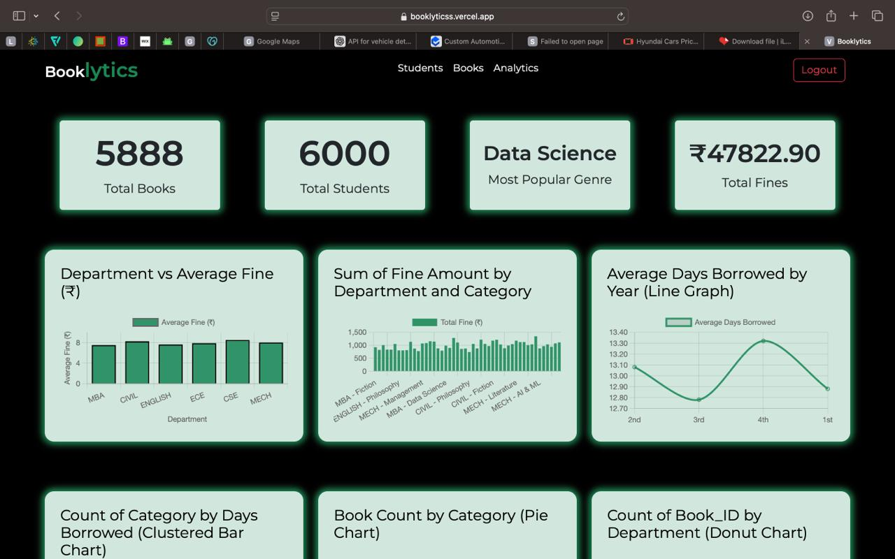
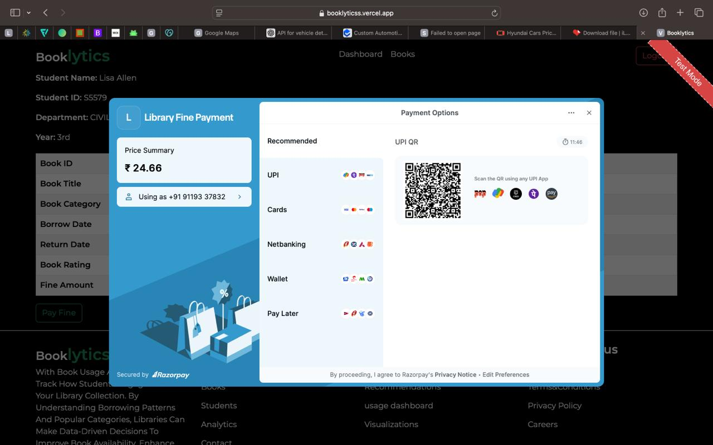
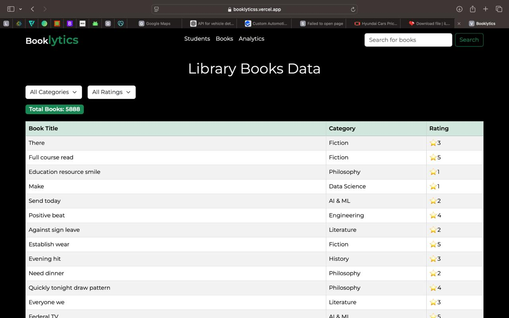
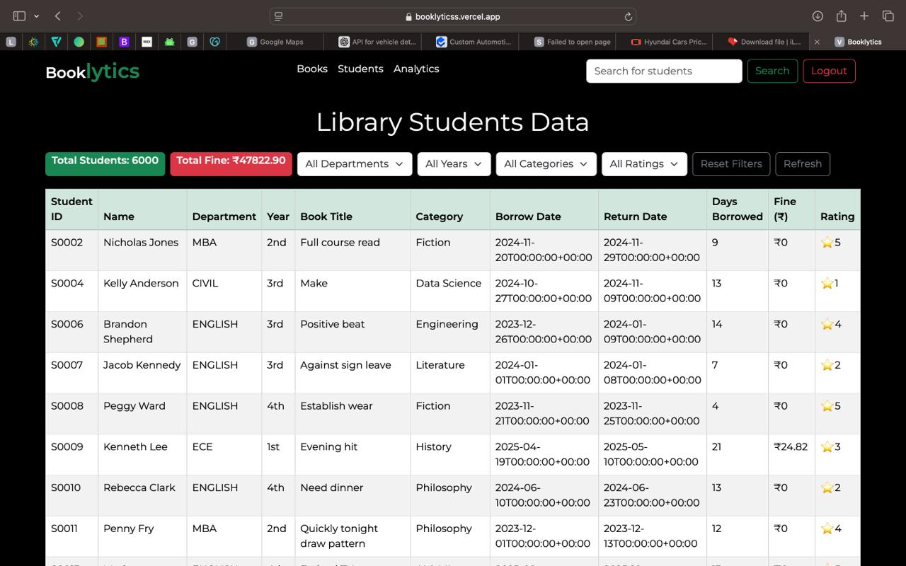
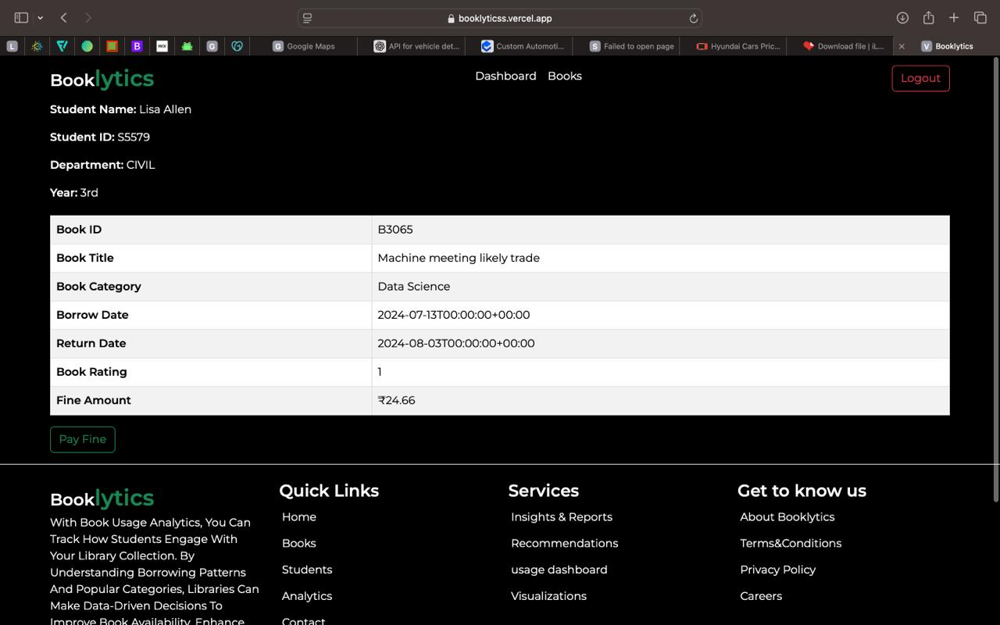
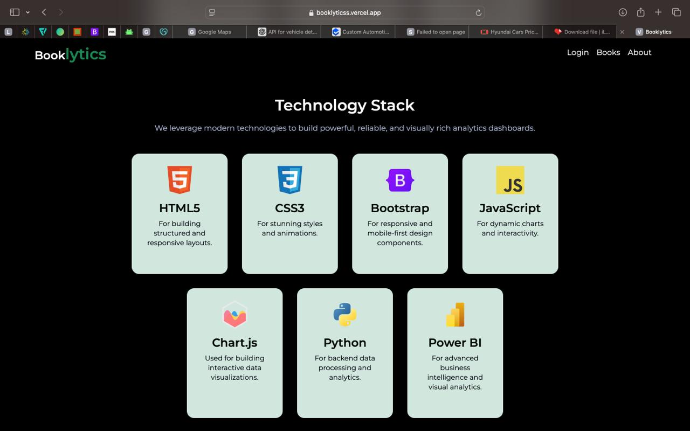
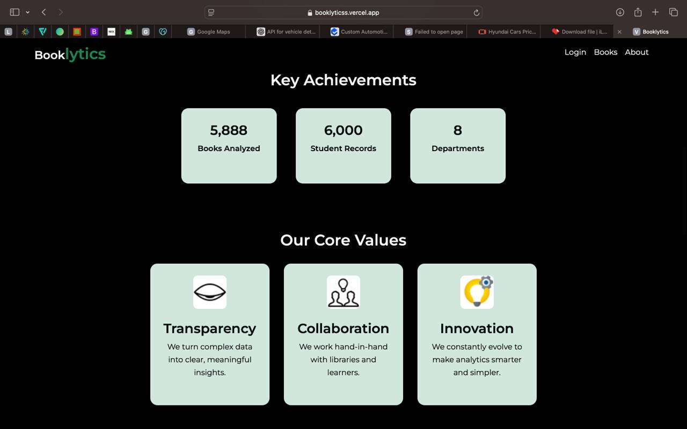
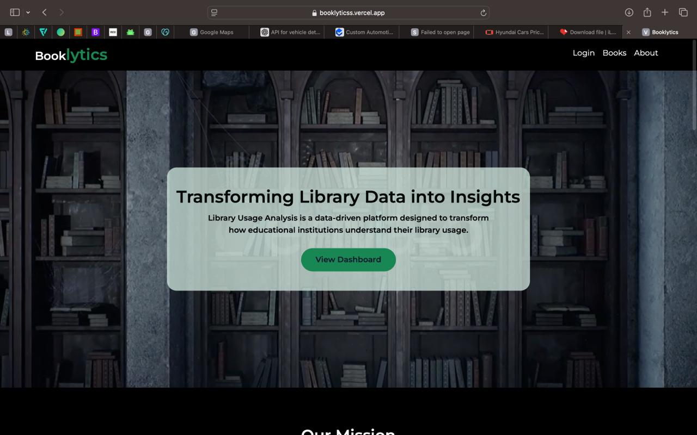
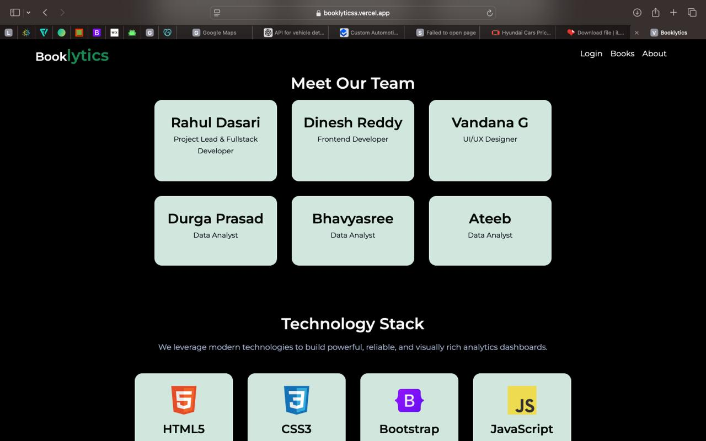
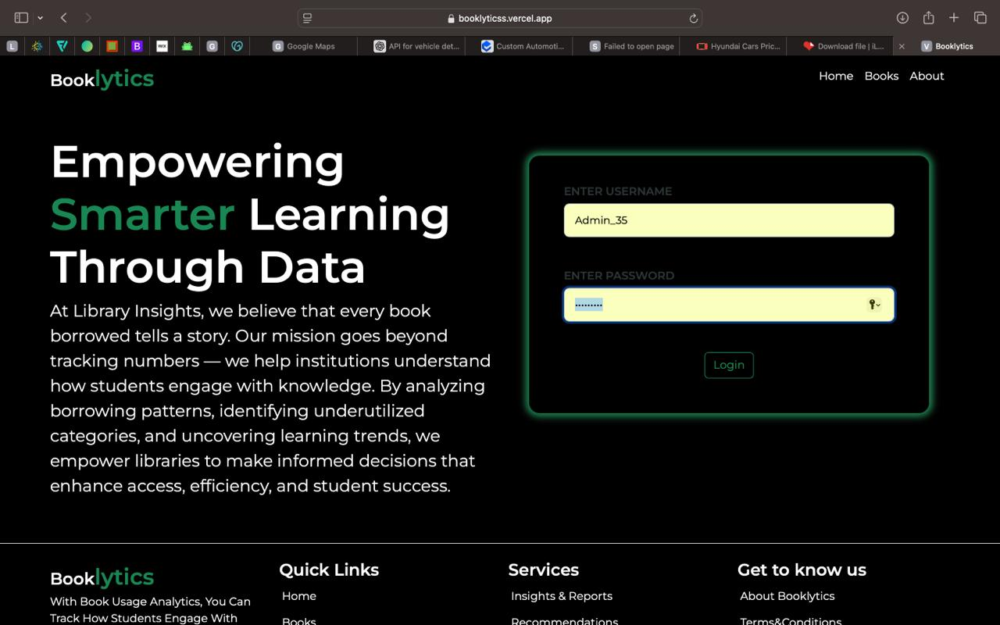

# 📚 Booklytics — Library Usage Analytics Platform

Booklytics is a **data-driven web application** that analyzes and visualizes **library usage patterns** using HTML, CSS, JS, Python, and Supabase.  
It’s deployed via **Vercel** (frontend) and connected to a **Supabase backend** for real-time data.

---

## 🌐 Live Demo
🔗 [Vercel Deployment](https://booklyticss.vercel.app/index.html)

---

## 🧠 Features
- Interactive dashboard for library usage
- Realtime Supabase database integration
- Data visualization using Python
- Deployed frontend via Vercel
- Clean, responsive interface

---

## 🏗️ Tech Stack

| Layer | Technology | Purpose |
|-------|-------------|----------|
| Frontend | HTML, CSS, JS | Interface (hosted on Vercel) |
| Backend | Supabase | Database + Realtime API |
| Analytics | Python (Pandas, Matplotlib) | Data analysis |
| Hosting | GitHub + Vercel | Version control + deployment |

---

## ⚙️ Setup (Local)
```bash

# Clone 
git clone https://github.com/ateeb-mudabbir/ateeb-projects-portfolio.git
cd ateeb-projects-portfolio/Booklytics/frontend


## 📸 Sample Data Images

### 🏠 Home Page


### 📊 Analytics Dashboard


### 📚 Book Details


### 👩‍🎓 Student Records


### 💰 Transactions Page


### ⚙️ Admin Dashboard


### 🔍 Analytics Charts


### 🏆 Insights


### 📈 Trends


### 📗 Data Visualization



